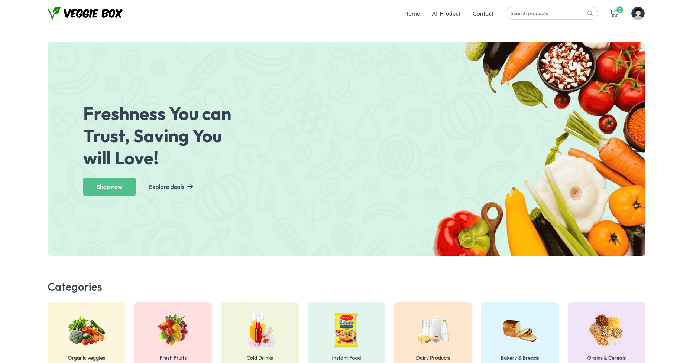
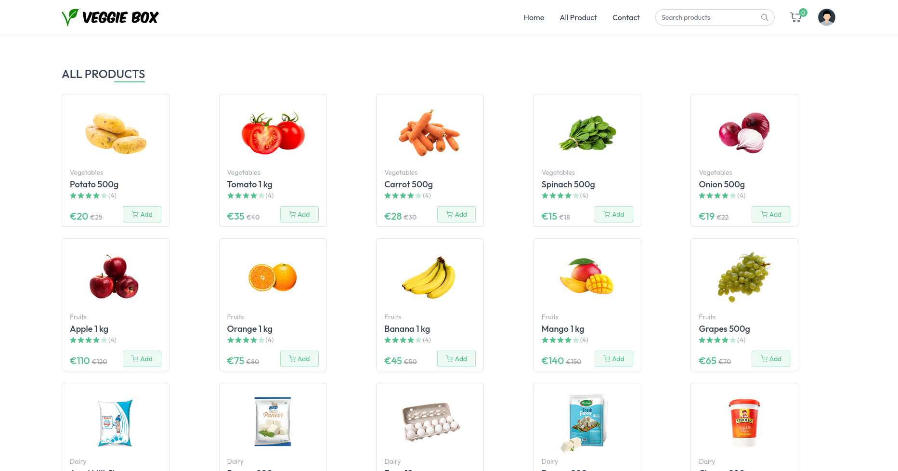
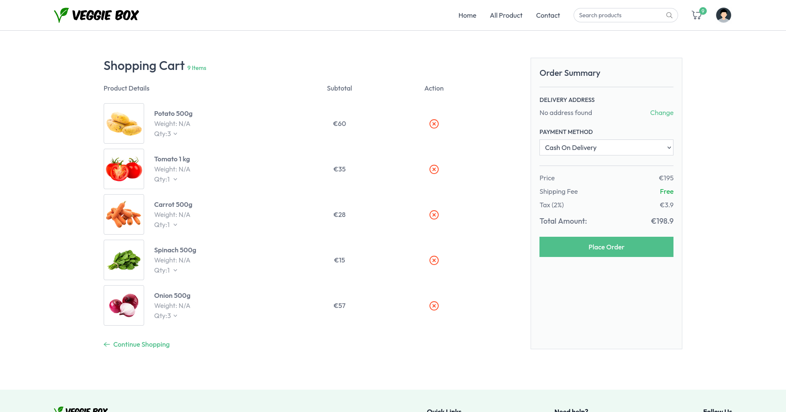
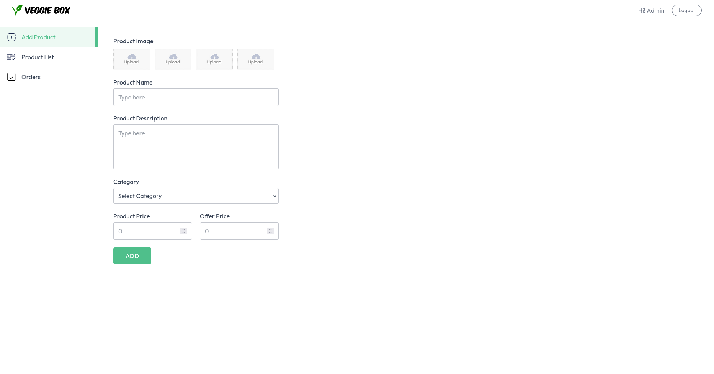

# VeggieBox


VeggieBox is a full-stack e-commerce platform for selling fresh groceries and snacks. It provides a seamless shopping experience for customers and a robust seller dashboard for managing products and orders.

## Live Demo

Check out the live application here: [VeggieBox Live](https://veggie-box.vercel.app/)

## Screenshots

### Home Page


### Product Page


### Cart Page


### Seller Dashboard


## Features

### User Features
- **Browse Products**: Explore a wide range of products categorized into Vegetables, Fruits, Dairy, Bakery, and more.
- **Search Products**: Quickly find products using the search bar.
- **Add to Cart**: Add products to the cart and manage quantities.
- **Checkout**: Place orders using Cash on Delivery (COD) or Stripe for online payments.
- **Order Tracking**: View order history and track the status of placed orders.
- **Address Management**: Add and manage shipping addresses.

### Seller Features
- **Seller Login**: Secure login for sellers to access the dashboard.
- **Add Products**: Upload product details and images.
- **Manage Inventory**: Update stock availability for products.
- **View Orders**: Access all orders placed by customers.

 
## Tech Stack

### Frontend
- **React**: For building the user interface.
- **Vite**: For fast development and build processes.
- **Tailwind CSS**: For styling the application.
- **React Router**: For client-side routing.
- **Axios**: For making API requests.

### Backend
- **Node.js**: For building the server-side application.
- **Express.js**: For handling API routes and middleware.
- **MongoDB**: For storing user, product, and order data.
- **Mongoose**: For interacting with the MongoDB database.
- **Cloudinary**: For managing product images.
- **Stripe**: For handling online payments.


## Installation

### Prerequisites
- Node.js (v16 or later)
- MongoDB
- Cloudinary account
- Stripe account

### Steps
1. Clone the repository:
   ```sh
   git clone https://github.com/ploosond/VeggieBox
   cd veggiebox
   ```

2. Set up the backend:
    ```sh
    cd server
    npm install
    ```
    Create a .env file in the server directory with the following variables:
   ```sh
    PORT=4000
    MONGODB_URI=your-mongodb-uri
    CLOUDINARY_CLOUD_NAME=your-cloudinary-cloud-name
    CLOUDINARY_API_KEY=your-cloudinary-api-key
    CLOUDINARY_SECRET=your-cloudinary-secret
    STRIPE_SECRET_KEY=your-stripe-secret-key
    STRIPE_WEBHOOK_SECRET=your-stripe-webhook-secret
    JWT_SECRET=your-jwt-secret
    SELLER_EMAIL=your-seller-email
    SELLER_PASSWORD=your-seller-password
   ```
    Start the backend server:
   ```sh
   npm run dev
   ```

   3. Set up the frontend:
   ```sh
   cd ../client
   npm install
   ```

   Create a .env file in the client directory with the following variables:
   ```sh
    VITE_BACKEND_URL=http://localhost:4000
    VITE_CURRENCY=₹
    ```

4. Open the application:

    Frontend: http://localhost:5173
    Backend: http://localhost:4000

## API Endpoints

### User Routes
- **POST** `/api/user/register`: Register a new user.
- **POST** `/api/user/login`: Login a user.
- **GET** `/api/user/is-auth`: Check user authentication.
- **POST** `/api/user/logout`: Logout a user.

### Seller Routes
- **POST** `/api/seller/login`: Login a seller.
- **GET** `/api/seller/is-auth`: Check seller authentication.
- **POST** `/api/seller/logout`: Logout a seller.

### Product Routes
- **POST** `/api/product/add`: Add a new product.
- **GET** `/api/product/list`: Get all products.
- **POST** `/api/product/stock`: Update product stock.

### Order Routes
- **POST** `/api/order/cod`: Place an order with COD.
- **POST** `/api/order/stripe`: Place an order with Stripe.
- **GET** `/api/order/user`: Get user orders.
- **GET** `/api/order/seller`: Get all orders for the seller.

### Address Routes
- **POST** `/api/address/add`: Add a new address.
- **GET** `/api/address/get`: Get all addresses for a user.

### Cart Routes
- **POST** `/api/cart/update`: Update user cart.